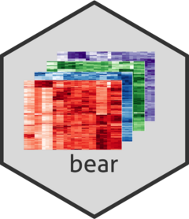

<!-- README.md is generated from README.Rmd. Please edit that file -->

# bears 

<!-- badges: start -->

[](https://lifecycle.r-lib.org/articles/stages.html#experimental)
[](https://codecov.io/gh/almeidasilvaf/bears?branch=main)
[](https://github.com/almeidasilvaf/bears/actions)
<!-- badges: end -->

The goal of `bears` is to download RNA-seq data from NCBI SRA,
preprocess them, map to the reference genome, and quantify the
expression at the gene level. The goal of bears is to make RNA-seq data
analysis pipelines reproducible, with a framework built on state-of-the
art methods and softwares.

## Installation instructions

Get the latest stable `R` release from
[CRAN](http://cran.r-project.org/). Then install `bears` from GitHub
with:

``` r
if (!requireNamespace("remotes", quietly = TRUE)) {
    install.packages("remotes")
}

remotes::install("almeidasilvaf/bears")
```

## Code of Conduct

Please note that the `bears` project is released with a [Contributor
Code of Conduct](http://bioconductor.org/about/code-of-conduct/). By
contributing to this project, you agree to abide by its terms.
